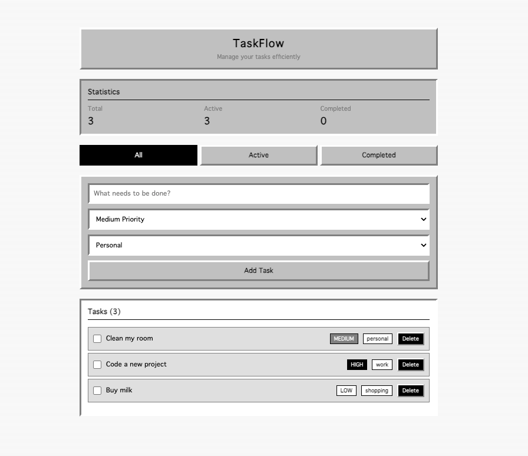

# 🖥️ TaskFlow - Mac OS Classic Edition

A retro-styled task management app inspired by Mac OS System 7/8 aesthetics.



## ✨ Features

- ✅ **CRUD Operations** - Create, read, update, and delete tasks
- 🎯 **Priority Levels** - High, Medium, Low
- 📁 **Categories** - Work, Personal, Shopping
- 🔍 **Filters** - View All, Active, or Completed tasks
- 💾 **localStorage** - Tasks persist across sessions
- 📊 **Statistics** - Real-time task counters
- ✏️ **Inline Edit** - Click on task title to edit
- 🎨 **Retro UI** - Authentic Mac OS 90s design

## 🛠️ Tech Stack

- **React 18** - UI library
- **TypeScript** - Type safety
- **Vite** - Build tool
- **useReducer + Context** - State management
- **CSS3** - Mac OS Classic styling
- **localStorage API** - Data persistence

## 🚀 Live Demo

[View Live App](https://taskflow-three-orpin.vercel.app/)

## 💻 Local Development

```bash
# Clone
git clone https://github.com/wizozero/taskflow.git
cd taskflow

# Install
npm install

# Run
npm run dev
```

## 📝 License

MIT
